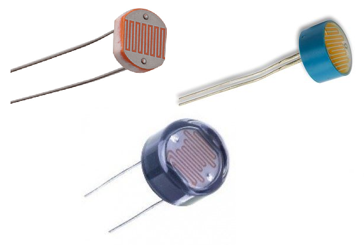
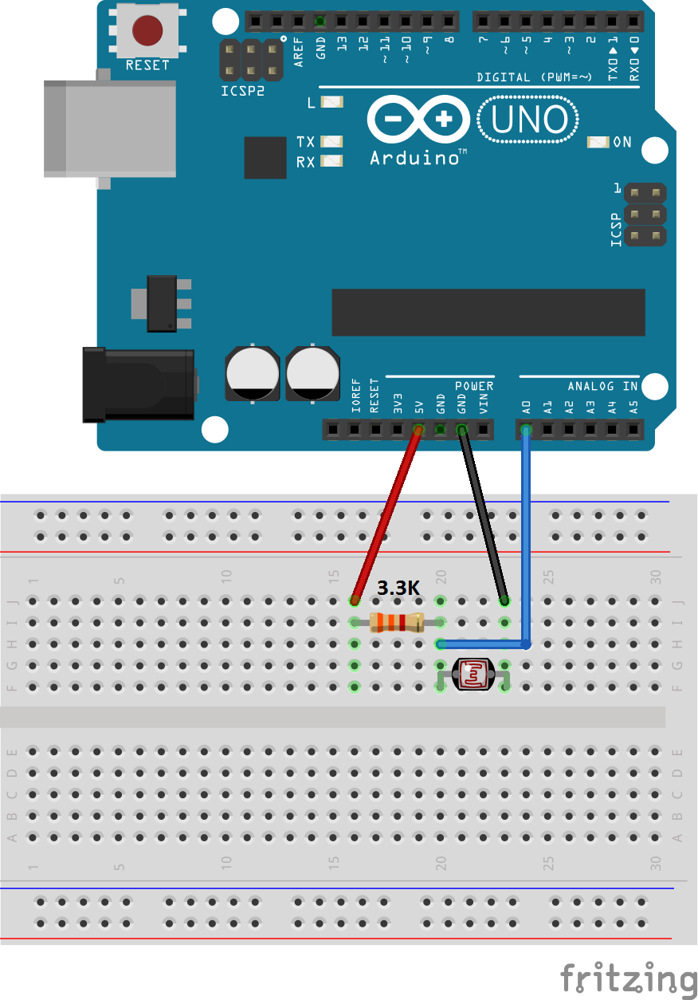

# Photocell (Light Dependent Resistor) Library for Arduino
   

## What is it

This library (with examples) is designed to be integrated in projects using any kind of photocell to retrieve the light intensity (in Lux or footcandles).
It handles the GL55xx photocell series but any other photocell can be configured too.

## How to install

1) Download <a target="_blank" href="https://github.com/QuentinCG/Arduino-Light-Dependent-Resistor-Library/releases">latest release</a>

2) On your Arduino IDE, click "Sketch" menu and then "Include Library > Add .ZIP Libraries"

3) You can now use the library for your project or launch an example ("File > Examples")

## How to connect a photocell to your Arduino

You'll need a resistor in addition of the sensor in order to create a "voltage bridge".
The needed voltage can be either 5V or 3.3V.

Here is an example for the GL5528 photocell:

## Examples

One example is provided with this library:

### Show light intensity every second with GL5528 photocell (in lux and footcandles)
<a target="_blank" href="https://github.com/QuentinCG/Arduino-Light-Dependent-Resistor-Library/blob/master/examples/GL5528BasicExample/GL5528BasicExample.ino">Link to source code</a>

## How to use this library

### With GL55xx photocells

If your photocell is in the GL55x series, you just have to initialize the photocell class with the right element:

|Photocell|Init value                      |
|-------- |--------                        |
|GL5516   |LightDependentResistor::GL5516  |
|GL5528   |LightDependentResistor::GL5528  |
|GL5537-1 |LightDependentResistor::GL5537_1|
|GL5537-2 |LightDependentResistor::GL5537_2|
|GL5539   |LightDependentResistor::GL5539  |
|GL5549   |LightDependentResistor::GL5549  |

### With any other photocell

In order to use an other photocell, you'll have to provide the library a curve of this kind: I[lux]=constant_1/(R[Ω]^constant_2).

Most of the time, the curves are logarithmic curves which mean you'll have to transform and solve equations.
A full explanation on how to do it step by step is shown in the <a href="https://github.com/QuentinCG/Arduino-Light-Dependent-Resistor-Library/blob/master/LightDependentResistor.h">header file</a>.
You'll also find how GL55xx equations were solved in the <a href="https://github.com/QuentinCG/Arduino-Light-Dependent-Resistor-Library/blob/master/doc/GL55_calculation.xls">Excel sheet</a>.

## License

This project is under MIT license. This means you can use it as you want (just don't delete the library header).

## Contribute

If you want to add more examples or improve the library, just create a pull request with proper commit message and right wrapping.

Thank you [leonheuler](https://github.com/leonheuler/) for his [fork](https://github.com/leonheuler/Arduino-Light-Dependent-Resistor-Library) helping me improve the ADC bits resolution handling in the library.
